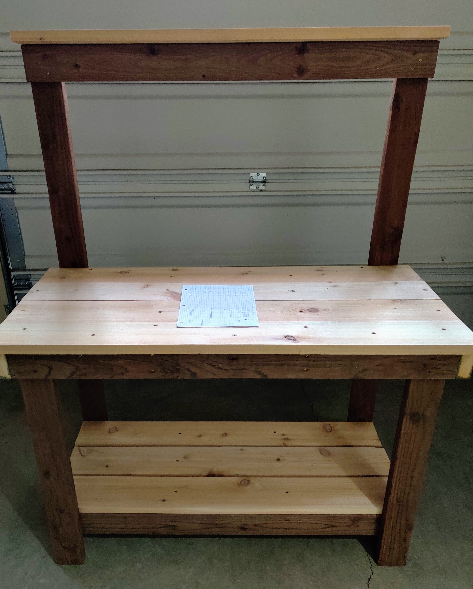
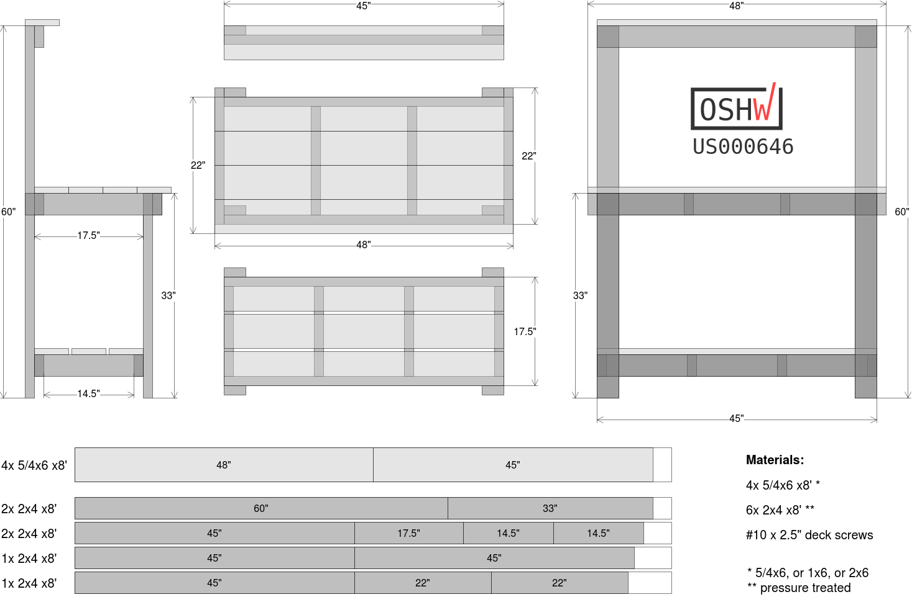
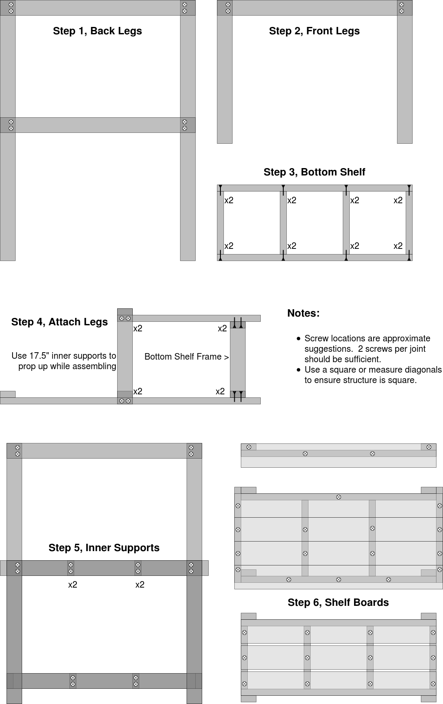

# planting-bench
Plans for planting bench

This is an OSHW certified (US000646) basic DIY planting bench.  It only uses 3 different materials and is desinged for minimal waste.

[Open plans in diagrams.net](https://app.diagrams.net/?#Uhttps%3A%2F%2Fgithub.com%2Fgsteiert%2Fplanting-bench%2Fraw%2Fmaster%2Fplans.drawio)

## Assembly Instructions

